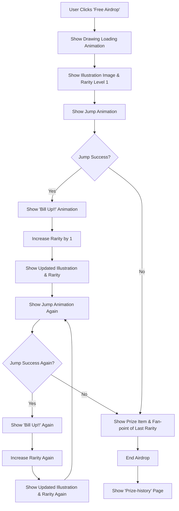

# Gacha Airdrop System Documentation

## Overview

This document describes the Free Airdrop system for the Gacha application. The airdrop feature allows users to participate in a dynamic reward system where they can potentially increase their rewards through a series of jump challenges.

## How It Works

### Initial Airdrop Process
1. **User Initiates**: User clicks the 'Free Airdrop' button
2. **Loading Animation**: A drawing loading animation is displayed to build anticipation
3. **Initial Display**: The system shows an illustration image with Rarity Level 1
4. **First Challenge**: A jump animation is triggered for the first challenge

### Jump Challenge Mechanics
The core of the airdrop system revolves around jump challenges that can increase rarity levels:

- **Jump Success**: If the jump is successful:
  - Shows 'Bill Up!!' animation
  - Increases rarity by 1 level
  - Displays updated illustration and new rarity level
  - Triggers another jump animation for another chance

- **Jump Failure**: If the jump fails:
  - Proceeds directly to prize distribution
  - Shows prize item and fan-points based on the last achieved rarity level

### Progressive Rarity System
The system allows for multiple successful jumps, creating a progressive rarity increase:
- Each successful jump increases rarity by 1 level
- Users can continue jumping as long as they succeed
- The final reward is based on the highest rarity level achieved

### Prize Distribution
- **Prize Items**: Rewards are determined by the final rarity level reached
- **Fan Points**: Bonus points are awarded based on the achieved rarity
- **History**: All airdrop results are recorded in the 'Prize-history' page

## Flowchart




## Installation

1. Download/fork/clone the repo and Once you're in the correct directory, it's time to install all the necessary dependencies. You can do this by typing the following command:

```
npm install
```
If you're using **Yarn** as your package manager, the command will be:

```
yarn install
```

2. Okay, you're almost there. Now all you need to do is start the development server. If you're using **npm**, the command is:

```
npm run dev
```
And if you're using **Yarn**, it's:

```
yarn dev
```


